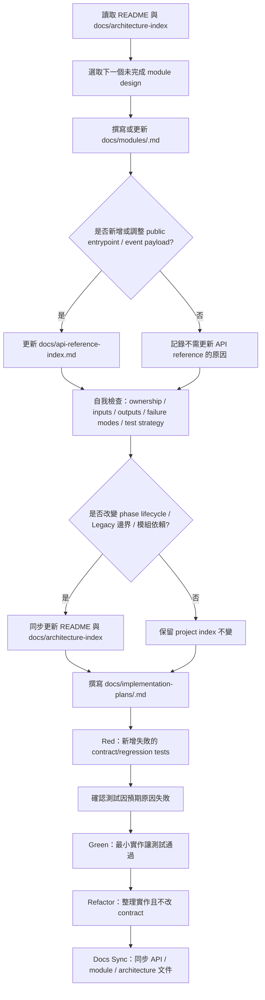

# YouTubeBridgeV2 Architecture Index

本文件描述 YouTubeBridgeV2 的高層級架構與模組邊界。它不是 implementation plan，不包含低階 class/function 設計。

## 架構原則

- V2 以 phase lifecycle 作為核心，不以舊 director fallback 作為核心。
- 正式節目段由 LiveEpisodePlan 驅動；雜談由 Aftertalk phase 驅動。
- Adapter 負責外部系統溝通，runtime core 不直接知道 HTTP、YouTube SDK 或 UI 細節。
- MemoriaCore 的 group chat 能力可作為 Aftertalk 的對話引擎，但 V2 仍負責何時觸發、何時停止與如何記錄 phase。
- 舊 `YouTubeBridge/` 可以提供參考，但不是 V2 的模組邊界來源。

## Phase Lifecycle

```text
planned_show -> aftertalk -> closing -> ended
```

### `planned_show`

正式節目 phase。LiveEpisodePlan runner 依照已匯入的企劃，推進 planned turn、觀眾插入事件與段落完成狀態。

### `aftertalk`

節目後雜談 phase。當 LiveEpisodePlan 完成、`AftertalkPolicy` 為 `auto`，且直播仍有剩餘時間時進入。Aftertalk 不使用 Legacy no-plan director；它由 V2 phase controller 觸發 MemoriaCore group chat，使角色在節目主題之後自然延伸討論。

### `closing`

收尾 phase。當直播時間到、操作者手動結束、或 planned show 完成且未啟用 Aftertalk 時進入。closing 負責 final closing、必要的 Super Chat 收尾與 session finalization。

### `ended`

已結束 phase。此 phase 不再產生直播互動，只允許讀取結果、摘要與診斷資料。

## 模組邊界

### Runtime Phase

擁有 phase state、transition rules、duration policy 與 phase transition metadata。它判斷下一個 phase，但不直接呼叫 YouTube 或 MemoriaCore。

### Runtime Application Service

擁有 runtime workflow orchestration。它讀取 storage snapshot、呼叫 Runtime Phase 做 pure decision、依 `next_action` dispatch LiveEpisodePlan / Aftertalk / Closing / adapters，並負責 transition write、command idempotency、recovery 與 event publish。Server/API Surface 只能委派 command 給此 service，不直接協調 runtime modules。

### LiveEpisodePlan Runner

擁有正式節目段的計畫推進。它讀取 LiveEpisodePlan contract，輸出目前 turn 的執行意圖、speaker policy、audience event handling policy 與 completion result。

### Aftertalk

擁有節目後雜談的觸發策略與 cue 內容。它不決定角色人格或生成內容本身，而是將 aftertalk cue 交給 MemoriaCore group chat。

### MemoriaCore Adapter

負責呼叫 MemoriaCore API。它將 V2 的 session/phase/context 轉成 MemoriaCore 可理解的 chat payload，並回收回覆、session id、trace metadata。

### YouTube Adapter

負責 YouTube live chat polling、event normalization、Super Chat metadata 與直播狀態讀取。它不決定節目流程。

### Closing

負責 `closing` phase 內的收尾工作。它整理 closing reason、session summary、未處理 Super Chat、final message intent、finalization result 與 `closing_completion_status`，但不決定何時進入 closing。

### Storage

負責定義 V2 session、phase state、events、interactions、adapter metadata 與 finalization result 的保存 contract。runtime core 透過 repository/interface 使用 storage；V2 storage 不直接連 SQLite，實際 SQLite 讀寫必須走主專案 `StorageManager`、`core/storage/` 與 `core/storage_manager.py` 邊界。Wave 2A 已建立 `core/storage/youtube_bridge_v2.py` durable backend，預設資料庫為 `runtime/youtubebridge_v2.db`。

### Server/API Surface

負責 V2 FastAPI 或其他 API 入口。它提供後台控制 UI、直播 Chat 顯示介面、observer、外部工具使用的 HTTP/SSE entrypoint，並把 request 轉交 runtime/application service。Server/API Surface 不直接持有 phase 決策或 adapter 實作細節。

### App Factory / Composition

負責 V2 root wiring。它把 StorageManager-like backend、Runtime Application Service、Query Service、HTTP route dependency override 與靜態 UI mount 組成可測試的 V2 app。Composition 不決定 phase 規則、不建立 SQLite connection、不引用 Legacy `YouTubeBridge/` runtime。

### Access Control / Security

負責 API 存取控制、loopback/API key 規則、MemoriaCore auth delegation、不可信 YouTube/MemoriaCore/UI payload 邊界與安全錯誤回應。Security 規則必須在 Server/API Surface 與 adapter module design 中被引用，不可分散成各路由的臨時判斷。

### Operator Console UI

負責後台操作者介面。第一階段需要能顯示 phase、LiveEpisodePlan 狀態、Aftertalk 開關、剩餘時間、closing 狀態、錯誤與手動控制入口。後台 UI 不直接推進 phase，只呼叫 API。

### Chat Display UI

負責直播畫面使用的 chat 顯示介面。它呈現觀眾留言、角色發言、Super Chat、系統狀態提示、Aftertalk/closing 狀態，以及 presentation/TTS 可用的顯示 metadata。Chat Display UI 不負責操作者設定，也不直接呼叫 runtime 控制 API。

### Observability

負責 trace、phase transition log、adapter request summary、MemoriaCore correlation id 與錯誤診斷入口。Observability 應記錄足夠狀態讓 agent 查問題，不暴露 raw hidden prompt。

### Presentation/TTS

負責可選的展示與語音輸出。Presentation/TTS 消費已完成的 interaction 或 response event，不參與 phase 決策。

## 初始 MVP 邊界

V2 MVP 應先完成可驗證的直通路：

1. 建立 V2 session。
2. 匯入或綁定 LiveEpisodePlan。
3. Runtime Application Service 讀取 session snapshot，呼叫 Runtime Phase 取得 `next_action`。
4. 執行 planned show phase。
5. LiveEpisodePlan 完成後，依 `AftertalkPolicy` 與剩餘時間進入 aftertalk 或 closing。
6. Aftertalk 透過 MemoriaCore group chat 產生角色接力。
7. 到達 planned duration 或收到 manual close 後進入 closing。
8. Closing 產生 finalization result 與 `closing_completion_status`。
9. Runtime Phase 在 closing complete 後進入 ended。

YouTube 真實 polling、完整後台控制台、直播 Chat 顯示、presentation/TTS 可以作為後續模組縱切，不應阻擋 runtime phase core 的第一版設計。

## Integration Wave 1 狀態

- [x] V2 app factory：已建立獨立 `create_v2_app(...)`，可掛載 `/v2` routes 與 `/v2/static`。
- [x] V2 composition：已建立 `create_v2_composition(...)`，集中組裝 runtime service、query service 與 storage port。
- [x] Runtime storage port：已建立 `RuntimeStoragePort`，只委派 StorageManager-like backend，不直接碰 SQLite。
- [x] Query service：已建立 `V2QueryService`，供 session status、phase、event history、operator/display SSE 使用。
- [x] Fake-backed vertical slice：已建立 tests 內 in-memory backend，覆蓋 create session、bind plan、planned show、aftertalk、manual/duration closing、ended 與 public payload redaction。

## Integration Wave 2A 狀態

- [x] StorageManager durable backend：已建立 `YouTubeBridgeV2RepositoryMixin` 與 `yb2_*` schema，SQLite 讀寫只存在於 `core/storage/`。
- [x] StorageManager wiring：`StorageManager(..., youtube_bridge_v2_db_path=None)` 可注入測試 DB，production default 使用 `runtime/youtubebridge_v2.db`。
- [x] Runtime storage round-trip：`RuntimeStoragePort` 會把 command result 存成 JSON-safe dict，讀回時還原為 `RuntimeServiceResult`。
- [x] Real-storage vertical slice：已用真 `StorageManager` + fake runners 驗證 create session、bind plan、planned show、aftertalk、manual close、closing、ended。
- [x] Restart/recovery：已驗證重建 `StorageManager` 與 composition 後可讀取同一 session snapshot 並執行 recovery decision。
- [x] Command idempotency：已驗證重啟後重送相同 `command_id` 不重複 dispatch runner，且 replay result 保持 runtime service contract。
- [x] Production V2 wiring：`api/main.py` 已在 Wave 2B 切換到真 V2 durable composition，外部 adapters 仍使用 explicit no-op runners。

## Integration Wave 2B 狀態

- [x] Production composition helper：已建立 `create_production_v2_composition(storage_manager, *, memoria_transport=None)`，以主專案 `StorageManager` singleton 建立 V2 composition；未顯式注入 Memoria transport 時預設使用 no-op runners。
- [x] Explicit no-op runners：已建立 planned show、aftertalk、closing 的 production-safe no-op runners，不呼叫 YouTube、MemoriaCore 或 TTS。
- [x] Main app `/v2` wiring：`api/main.py` 已用 lazy cached composition 覆寫 V2 runtime/query dependencies。
- [x] Loopback-only boundary：主 app `/v2` API/SSE 已限制 loopback；`/v2/static` 保持可服務前端資產。
- [x] Missing-session query errors：status、events、operator/display stream 對不存在 session 回 sanitized 404。
- [x] API key permission matrix：Wave 2C 已使用 prefs-backed API key 設定完成 operator/display/observer header auth，loopback request 仍以 operator 通過。
- [ ] Real adapter runners：真 YouTube、MemoriaCore 與 TTS integration 保留給後續 wave。

## Integration Wave 2C 狀態

- [x] API key 設定來源：`StorageManager.load_prefs()` 的 `youtubebridge_v2_api_keys` list 為唯一 2C secret source。
- [x] Main app security middleware：`V2MainSecurityMiddleware` 已套用於主 app `/v2` API/SSE，排除 `/v2/static`。
- [x] Permission matrix：operator 可控制與讀取所有 V2 API/SSE，observer 僅可讀 status/events/operator stream，display 僅可讀 display stream。
- [x] Fail-closed 行為：未設定有效 key、空 key 或無效 permission group 時，非 loopback request 不會進入 runtime dispatch。
- [x] Sanitized security errors：auth failure 回 stable `401/403` body，不暴露 API key、header 或 fingerprint。
- [ ] API key 管理 UI：prefs 寫入與輪替 UI 保留給後續 wave。

## Integration Wave 2D 狀態

- [x] Operator tick endpoint：已新增 `POST /v2/sessions/{session_id}/tick`，由 Server/API Surface 建立 `RuntimeCommandType.TICK` 並委派 `RuntimeApplicationService.tick_session(...)`。
- [x] Tick permission boundary：主 app security matrix 已將 tick 固定為 `operator` only；loopback 仍以 operator 通過，observer/display key 不可推進 runtime。
- [x] LiveEpisodePlan state persistence：`RuntimeStoragePort.bind_plan(...)` 會驗證 plan contract，並保存 sanitized `live_episode_plan_state`，包含 `contract`、`cursor`、`completed_turn_ids`、`last_memoria_session_id`。
- [x] Memoria runner vertical slice：已建立 injectable planned-show、aftertalk、closing runners，使用 `MemoriaTransportProtocol.send(...)`；未注入 transport 時 production composition 繼續使用 no-op runners。
- [x] Fake-transport E2E：已驗證 API create/bind/tick/manual-close/tick 可跑完 `planned_show -> aftertalk -> closing -> ended`，且 durable StorageManager rebuild 後可 replay command result。
- [ ] 真外部 transport：MemoriaCore production wiring toggle、YouTube polling、TTS delivery 與 background scheduler 仍保留給後續 wave。

## Integration Wave 2E-A 狀態

- [x] MemoriaCore transport config：已建立 `youtubebridge_v2_memoria_transport` prefs 設定解析，空設定代表未啟用，不硬寫 secret。
- [x] Sync HTTP client boundary：已建立可注入 `SyncJsonHttpClientProtocol` 與 stdlib `UrllibSyncJsonHttpClient`。
- [x] Memoria transport implementation：已建立 `MemoriaSyncHttpTransport`，符合 runner 使用的 `send(request) -> dict[str, object]`。
- [x] Production wiring toggle：已由 Wave 2E-D 完成；主 app 未設定、未啟用或設定錯誤時繼續 no-op，不意外外呼。

## Integration Wave 2E-B 狀態

- [x] Timeout / 5xx retry：`MemoriaSyncHttpTransport` 會依 `max_attempts` retry retryable transport errors。
- [x] Auth terminal mapping：HTTP 401/403 會轉成 terminal `auth_failure`，不重試。
- [x] Invalid response mapping：invalid JSON / non-object JSON response 會轉成 terminal `invalid_response`。
- [x] Sanitized error summary：URL、headers、token、authorization 與 raw payload 不進入 transport public summary 或 runner adapter summary。

## Integration Wave 2E-C 狀態

- [x] Real MemoriaCore integration harness：已建立 opt-in pytest harness，可在本機 MemoriaCore 8088 與明確 character id 設定下跑 real `/api/v1/chat/sync` round-trip。
- [x] Default pytest independence：未設定 `YB2_MEMORIA_INTEGRATION=1` 時，real external test skip，不依賴 MemoriaCore service、API key 或本機角色資料。

## Integration Wave 2E-D 狀態

- [x] Production wiring toggle：`create_production_v2_composition(...)` 未明確注入 transport 時，只在 prefs `youtubebridge_v2_memoria_transport.enabled` 明確啟用且 config valid 時建立 `MemoriaSyncHttpTransport`。
- [x] No-op fallback：未設定、未啟用或 invalid config 都維持 no-op runner，`/v2` tick 不意外外呼。
- [x] Explicit injection precedence：測試或手動 composition 傳入 `memoria_transport=` 時仍優先使用注入物件。

## Integration Wave 3A 狀態

- [x] Live chat event normalization handoff：`RuntimeApplicationService.handle_youtube_event(...)` 會把 raw YouTube live chat event 經 `normalize_youtube_event(...)` 轉成 storage-safe payload。
- [x] Runtime input persistence：`RuntimeStoragePort.persist_youtube_event(...)` 保存 normalized event id/type/public payload/display event，不保存 raw YouTube payload。
- [x] Scope boundary：polling cursor、YouTube API transport、scheduler ingestion 與 Super Chat closing handoff 保留給後續 3B/3C/3D。

## Integration Wave 3B 狀態

- [x] Polling cursor persistence：`RuntimeStoragePort` 可保存/讀回 session metadata 的 `youtube_polling_cursor`。
- [x] Restart recovery：重建 `StorageManager` 後可讀回 `YouTubePollingCursor`，seen event ids 不遺失。
- [x] Duplicate skip：runtime 用 cursor 判定 duplicate event id 時，只保存 ignored event summary，不重複 dispatch runner。

## Integration Wave 3C 狀態

- [x] Super Chat metadata handoff：closing runner 可從 `youtube_super_chat` live event 讀取 pending Super Chat public metadata。
- [x] Closing acknowledgement intent：pending Super Chat 會進入 `ClosingRequest.super_chat_actions` 與 Memoria closing external context。
- [x] Scope boundary：本階段不實際回覆 YouTube、不更新 acknowledgement durable status、不建立 scheduler/API ingestion path。

## Module Design 文件

後續設計應逐份建立在 `YouTubeBridgeV2/docs/modules/`：

- `runtime-phase.md`：已完成 module design。
- `runtime-application-service.md`：已完成 module design。
- `live-episode-plan.md`：已完成 module design。
- `aftertalk.md`：已完成 module design。
- `memoria-adapter.md`：已完成 module design。
- `closing.md`：已完成 module design。
- `storage.md`：已完成 module design。
- `server-api-surface.md`：已完成 module design。
- `access-control-security.md`：已完成 module design。
- `observability.md`：已完成 module design。
- `operator-console-ui.md`：已完成 module design。
- `chat-display-ui.md`：已完成 module design。
- `youtube-adapter.md`：已完成 module design。
- `presentation-tts.md`：已完成 module design。

## 建議 module design 順序

模組設計應先鎖定 runtime core，再接正式節目、雜談、MemoriaCore 與狀態保存，最後補 UI、真實 YouTube 與展示輸出：

1. `runtime-phase.md`：定義 phase、state、transition、duration policy。
2. `runtime-application-service.md`：定義 command orchestration、side-effect ordering、idempotency 與 recovery。
3. `live-episode-plan.md`：定義正式節目如何推進、完成與交回 phase controller。
4. `aftertalk.md`：定義節目後雜談何時開始、如何觸發、何時停止。
5. `memoria-adapter.md`：定義 planned show 與 aftertalk 如何呼叫 MemoriaCore/group chat。
6. `closing.md`：定義 closing phase 的 final message、Super Chat 收尾、finalization 與 completion status。
7. `storage.md`：定義 session、phase、event、interaction metadata 的保存邊界。
8. `server-api-surface.md`：定義 HTTP/SSE entrypoint、request/response/event payload 與 runtime service 邊界。
9. `access-control-security.md`：定義 API 存取控制、不可信輸入、auth delegation 與安全錯誤處理。
10. `observability.md`：定義 phase transition、adapter request、錯誤與 trace。
11. `operator-console-ui.md`：定義後台控制 UI 的資訊架構與操作入口。
12. `chat-display-ui.md`：定義直播 Chat 顯示介面的資料來源、顯示狀態與角色發言呈現。
13. `youtube-adapter.md`：定義真實 YouTube polling、live chat event 與 Super Chat。
14. `presentation-tts.md`：定義展示與語音輸出的 event 消費邊界。

## Module Design + Red-Green Workflow

每個模組都先完成 module design，再產生該模組的 implementation plan。implementation plan 必須以 Red-Green-Refactor 展開，先把 module design 轉成失敗測試，再寫最小實作讓測試通過。若設計或實作過程發現上游 contract 不足，先回頭修正上游文件，不要在 implementation plan 或 code 裡偷偷補架構決策。



## Red-Green-Refactor 規則

Red-Green-Refactor 是施工方法，不是 V2 runtime 的功能模組。它不出現在 phase lifecycle，也不會成為 API surface。

- Module design 的 `Test Strategy` 是後續 red tests 的來源。
- implementation plan 必須列出 red cases、green scope、refactor boundary、adapter strategy 與 docs sync。
- Red 階段要先確認測試失敗原因符合預期，再開始實作。
- Green 階段只寫足以通過 red tests 的最小 runtime code。
- Refactor 階段可以整理命名、結構與重複邏輯，但不得改變已定義 public contract。
- Docs-only 變更以文件一致性檢查取代 runtime red test。

## Module Design Checklist

- [x] `runtime-phase.md`：完成 phase model、transition policy、duration policy、completion criteria、failure modes、test strategy。
- [x] `runtime-application-service.md`：完成 command orchestration、side-effect ordering、idempotency、manual close priority、crash/restart recovery、event publish 邊界。
- [x] `live-episode-plan.md`：完成 LiveEpisodePlan runner 的 inputs、outputs、planned turn 推進、觀眾插入事件邊界、完成後交回 phase controller 的規則。
- [x] `aftertalk.md`：完成 `AftertalkPolicy`、進入條件、停止條件、aftertalk cue、與 MemoriaCore group chat 的責任切分。
- [x] `memoria-adapter.md`：完成 MemoriaCore request/response contract、group chat 呼叫方式、session id 回收、trace/correlation metadata。
- [x] `closing.md`：完成 closing reason、final message intent、Super Chat 收尾、finalization result、`closing_completion_status`、recovery 與 redaction 邊界。
- [x] `storage.md`：完成 V2 session、phase state、event、interaction、adapter metadata、finalization result 與 `StorageManager` 存取邊界。
- [x] `server-api-surface.md`：完成 HTTP/SSE entrypoint、request/response/event payload、runtime service 呼叫邊界、UI/observer API 需求。
- [x] `access-control-security.md`：完成 loopback/API key、MemoriaCore auth delegation、不可信輸入處理、權限錯誤、secret/config 邊界。
- [x] `observability.md`：完成 phase transition log、adapter request summary、錯誤分類、trace 查找入口、hidden prompt 不外洩規則。
- [x] `operator-console-ui.md`：完成後台控制 UI 資訊架構、Aftertalk 開關、phase 狀態、手動控制、錯誤顯示與 API 需求。
- [x] `chat-display-ui.md`：完成直播 Chat 顯示資料來源、角色發言呈現、觀眾留言/Super Chat 顯示、Aftertalk/closing 狀態提示。
- [x] `youtube-adapter.md`：完成 YouTube live chat polling、event normalization、Super Chat metadata、直播狀態與錯誤處理邊界。
- [x] `presentation-tts.md`：完成 presentation/TTS 消費事件、ack/timeout、可見 metadata、與 phase/runtime 的非決策邊界。

每個項目完成後，若產生 public entrypoint、endpoint 或 event payload，必須同步補 `docs/api-reference-index.md`。若產生跨模組依賴或 phase 規則調整，必須同步補本文件與 README。
