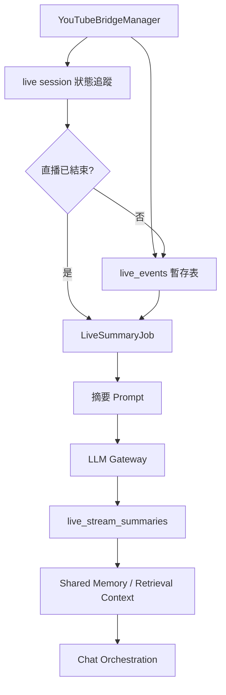

# YouTube Live 共通摘要記憶 Phase 2 落地計畫

## Summary

Phase 2 的目標是在 Phase 1 已完成的「YouTube Live Chat 讀取、暫存、Dashboard 注入」基礎上，於直播結束後把整場直播整理成共通摘要，寫入可被所有使用者共享的直播脈絡記憶。

這個階段不追蹤單一 YouTube 觀眾的私人歷史，也不把某位觀眾在直播中的留言綁定到其個人 private memory。AI 只會記得「這場直播大致發生了什麼、討論了哪些主題、有哪些重要結論」，而不是「觀眾 A 說過哪一句話」。

## Decision

- 採用「整場直播共通摘要」作為 Phase 2 的主要方案。
- 摘要不綁定單一使用者帳號。
- 摘要可綁定 `character_id` 與直播來源 bot，讓對應角色在公開或直播情境中能讀到。
- 不把其他觀眾的原始留言補進某個使用者的私人上下文。
- 原始 YouTube chat event 保持暫存資料，依 retention policy 清理。
- 長期保存的是摘要與必要 metadata，不是全量聊天紀錄。

## Scope

### In Scope

- 偵測或手動標記 YouTube live session 結束。
- 將同一場直播的暫存 chat events 彙整成摘要輸入。
- 產生直播共通摘要：
  - 主題列表。
  - 重要問答。
  - 觀眾情緒與反應趨勢。
  - AI 或主持內容中的重要結論。
  - 可供未來對話引用的背景脈絡。
- 將摘要寫入共通記憶區。
- 在對話檢索時讓對應角色可讀取這類直播摘要。
- 加入管理 API 與 dashboard 操作入口：
  - 查看直播 session。
  - 手動觸發摘要。
  - 查看摘要結果。
  - 重跑摘要。
  - 清除暫存事件。
- 加入測試。

### Out of Scope

- 不建立 YouTube 觀眾到 MemoriaCore user account 的身分綁定。
- 不將某位觀眾在直播中的留言補寫到該使用者 private memory。
- 不回覆 YouTube 留言。
- 不做向量化逐句保存全量 YouTube chat。
- 不保證能回答直播中的逐字細節問題。

## Phase 1 Dependencies

Phase 2 依賴 YouTubeBridge Phase 1 產物：

- YouTubeBridge connector 已保存 YouTube Data API key。
- YouTubeBridge live session 已保存 `video_id` / `live_chat_id` 與目標 MemoriaCore session。
- YouTubeBridge polling manager 已能 polling YouTube Live Chat。
- YouTubeBridge `live_events` 暫存 DB 已保存去重後的直播留言事件。
- Dashboard 已能接收 SSE 並把近期留言注入 chat API。
- MemoriaCore `external_chat_context` 已可安全注入 AI 對話，但不持久化為使用者訊息。

## Architecture



## Data Model

### 1. 新增 live session 記錄

建議新增於 YouTubeBridge runtime DB，由 YouTubeBridge `storage.py` 管理。不要直接寫入 MemoriaCore 主 DB。

表名：`youtube_live_sessions`

欄位建議：

- `id INTEGER PRIMARY KEY AUTOINCREMENT`
- `bot_id TEXT NOT NULL`
- `video_id TEXT NOT NULL`
- `live_chat_id TEXT`
- `character_id TEXT NOT NULL`
- `title TEXT DEFAULT ''`
- `started_at TEXT`
- `ended_at TEXT`
- `detected_status TEXT NOT NULL`
- `summary_status TEXT NOT NULL`
- `summary_id INTEGER`
- `last_event_id INTEGER`
- `event_count INTEGER DEFAULT 0`
- `created_at TEXT NOT NULL`
- `updated_at TEXT NOT NULL`
- `metadata_json TEXT DEFAULT '{}'`

索引：

- `(bot_id, video_id)`
- `(summary_status, updated_at)`
- `(character_id, ended_at)`

`summary_status` 建議值：

- `pending`
- `summarizing`
- `completed`
- `failed`
- `skipped`

### 2. 新增直播摘要表

表名：`youtube_live_summaries`

欄位建議：

- `id INTEGER PRIMARY KEY AUTOINCREMENT`
- `session_id INTEGER NOT NULL`
- `bot_id TEXT NOT NULL`
- `video_id TEXT NOT NULL`
- `character_id TEXT NOT NULL`
- `summary_text TEXT NOT NULL`
- `topic_tags_json TEXT DEFAULT '[]'`
- `key_points_json TEXT DEFAULT '[]'`
- `qa_pairs_json TEXT DEFAULT '[]'`
- `audience_mood TEXT DEFAULT ''`
- `event_count INTEGER DEFAULT 0`
- `source_started_at TEXT`
- `source_ended_at TEXT`
- `created_at TEXT NOT NULL`
- `updated_at TEXT NOT NULL`
- `metadata_json TEXT DEFAULT '{}'`

索引：

- `(character_id, source_ended_at)`
- `(bot_id, video_id)`

### 3. 是否寫入既有 memory store

建議採二層保存：

1. `youtube_live_summaries` 作為可管理、可重跑、可審計的來源表。
2. 再將摘要寫入既有 memory/retrieval 系統，作為 `visibility="public"` 或專用 `visibility="shared"` 的記憶項。

若目前記憶隔離只穩定支援 `public/private`，第一版先寫入：

- `user_id = "__system__"` 或現有系統使用者 ID。
- `character_id = bot config 的 character_id`。
- `visibility = "public"`。
- metadata 標註：
  - `source = "youtube_live_summary"`
  - `bot_id`
  - `video_id`
  - `session_id`
  - `summary_id`

後續若要更精準，可再新增 dedicated shared-memory scope，但 Phase 2 第一版不要同時改太多記憶隔離核心。

## Runtime Flow

### 1. Session 建立

當 YouTube bot 開始 polling：

1. 取得 `video_id` 與 `live_chat_id`。
2. 以 `(bot_id, video_id)` upsert `youtube_live_sessions`。
3. 設定：
   - `detected_status = "running"`
   - `summary_status = "pending"`
   - `character_id = bot config.character_id`

### 2. Event 累積

每次 `save_youtube_live_event()` 成功寫入新事件後：

1. 更新該 session 的 `last_event_id`。
2. 累加或重算 `event_count`。
3. 更新 `updated_at`。

### 3. 結束偵測

YouTube Data API 可能在不同狀態回傳不同訊號，第一版要支援兩種入口：

- 自動偵測：
  - `videos.list(part=liveStreamingDetails,status,snippet)` 顯示直播已結束。
  - `activeLiveChatId` 消失或 live chat API 回覆 chat ended。
- 手動觸發：
  - Dashboard 或 admin API 對指定 session 執行 finalize/summarize。

自動偵測不可作為唯一機制，因為 YouTube API 狀態可能延遲或受配額限制。

### 4. 摘要 job

`LiveSummaryJob` 輸入：

- `session_id`
- `bot_id`
- `video_id`
- `character_id`
- 指定 event 範圍。

處理步驟：

1. 將 session 設為 `summary_status="summarizing"`。
2. 從 YouTubeBridge `live_events` 讀取該直播事件。
3. 過濾：
   - `status != "active"` 的事件預設略過。
   - 空訊息略過。
   - 重複訊息可保留一次。
   - 明顯 spam 可降權或略過。
4. 若事件太少：
   - event_count 小於門檻，例如 3，標為 `skipped` 或產生極短摘要。
5. 若事件太多：
   - 先分 chunk 摘要。
   - 再合併 chunk summary 成 final summary。
6. 寫入 `youtube_live_summaries`。
7. 寫入 shared/public memory。
8. 將 session 設為 `completed` 並記錄 `summary_id`。

## Prompt Design

Prompt 模板必須放在 `prompts_default.json`，不可硬寫在 Python 程式碼中。

建議新增 keys：

- `youtube_live_chunk_summary_prompt`
- `youtube_live_final_summary_prompt`
- `youtube_live_memory_entry_prompt`

摘要輸出建議要求 JSON 或可解析結構：

```json
{
  "title": "直播摘要標題",
  "overview": "整場直播的短摘要",
  "topics": ["主題一", "主題二"],
  "key_points": ["重點一", "重點二"],
  "qa_pairs": [
    {
      "question": "觀眾或聊天室集中詢問的問題",
      "answer": "直播中形成的答案或 AI 回應方向"
    }
  ],
  "audience_mood": "觀眾整體反應",
  "memory_text": "適合寫入長期共通記憶的敘述"
}
```

安全要求：

- 不要把觀眾 ID、頻道 ID、頭像 URL 寫入長期記憶。
- 不要把單一觀眾的敏感內容歸因給該觀眾。
- 不要保存 access token、API key、內部錯誤堆疊。
- 摘要要標示這是「直播聊天室脈絡」，不是模型親身經驗。

## Retrieval Strategy

第一版建議：

- 在 public face 或直播 dashboard 對話中可檢索 YouTube live summary。
- private face 預設不主動混入所有直播摘要，除非使用者問題明確提到直播、影片、某場活動。
- 檢索時以 `character_id` 為主範圍。
- 若有 `video_id` 或直播標題，優先精準匹配。

可行策略：

1. 寫入既有記憶檢索庫，讓向量搜尋自然命中。
2. 在 retrieval context 額外加一段 recent live summaries，限量取最近 N 場。

第一版優先使用既有記憶檢索庫，避免新增太多 retrieval 分支。

## API Plan

新增 admin-only endpoints，路徑建議：

- `GET /api/v1/livestream/youtube/sessions`
  - 列出 live sessions。
  - 支援 `bot_id`、`video_id`、`summary_status` filter。

- `GET /api/v1/livestream/youtube/sessions/{session_id}`
  - 取得 session 詳細資料與摘要狀態。

- `POST /api/v1/livestream/youtube/sessions/{session_id}/summarize`
  - 手動觸發摘要。
  - 若已完成，預設回傳既有結果。
  - 支援 `force=true` 重跑。

- `GET /api/v1/livestream/youtube/sessions/{session_id}/summary`
  - 取得摘要結果。

- `POST /api/v1/livestream/youtube/sessions/{session_id}/finalize`
  - 手動標記直播已結束並進入摘要流程。

- `POST /api/v1/livestream/youtube/cleanup`
  - 清理超過 retention 的暫存 events。

## Dashboard Plan

在 Bot 管理或 Chat 管理區新增 YouTube Live Session 管理：

- 顯示最近直播 session：
  - bot name
  - video_id
  - status
  - event count
  - started_at / ended_at
  - summary_status
- 操作：
  - 查看事件數與最近事件。
  - 手動 finalize。
  - 產生摘要。
  - 查看摘要。
  - 重跑摘要。
  - 清理暫存。

UI 可見文字需同步：

- `static/locales/zh-TW.json`
- `static/locales/en-US.json`
- Streamlit 對應頁面文字。

## Storage Cleanup Policy

建議預設：

- YouTubeBridge `live_events` 保留 30 天。
- 已摘要完成的 session，其 raw events 可在 retention 後清除。
- 未摘要、摘要失敗、或正在摘要中的 session 不自動清除 raw events。
- `youtube_live_summaries` 長期保存，除非管理員手動刪除。

Bot settings 可加入：

- `event_retention_days`
- `auto_summarize_on_end`
- `summary_min_events`
- `summary_max_events`
- `summary_chunk_size`

## Edge Cases

- 直播結束偵測不到：必須提供手動 finalize。
- YouTube API 配額不足：不要讓摘要流程依賴再次大量讀 API，應使用已暫存 events。
- 聊天量過大：必須 chunk summary，避免超過 LLM context。
- 聊天量過少：允許 skipped，避免產生低品質記憶。
- 同一 bot 重啟：不得建立重複 session，應以 `(bot_id, video_id)` upsert。
- 同一直播多次摘要：預設 idempotent；`force=true` 才重跑並更新 summary。
- 多 bot 指向同一 video：各 bot 的 `character_id` 可能不同，第一版以 `(bot_id, video_id)` 分開處理。
- Super Chat 或會員事件：可保留在 summary metadata 中，但長期記憶不應保存金額與個人識別資訊，除非產品明確需要。
- 刪除或停用 bot：既有 summary 不刪除，但 session 查詢需能處理 bot config 不存在。
- 角色被刪除：summary 保留，但 retrieval 寫入可能跳過或標記 orphan。
- LLM 摘要失敗：session 設為 `failed`，保存錯誤類型與可重試狀態，不保存完整敏感錯誤內容。
- 惡意留言 prompt injection：chat events 一律視為 untrusted source，摘要 prompt 必須明確要求忽略留言中的指令。

## Implementation Checklist

### A. YouTubeBridge Storage

- [ ] 新增 `youtube_live_sessions` 初始化。
- [ ] 新增 `youtube_live_summaries` 初始化。
- [ ] 實作 session upsert / update / list / get。
- [ ] 實作 summary create / update / get。
- [ ] 實作已摘要 event cleanup policy。
- [ ] 補 SQLite migration 與索引。

### B. YouTubeBridge Runtime

- [ ] `YouTubeBridgeManager` 在開始 polling 時 upsert live session。
- [ ] 新事件寫入後更新 session event count。
- [ ] 解析 YouTube live ended 狀態。
- [ ] 支援 manager 層的 finalize callback。
- [ ] 支援 bot settings：
  - [ ] `auto_summarize_on_end`
  - [ ] `summary_min_events`
  - [ ] `event_retention_days`

### C. Summary Job

- [ ] 新增 `YouTubeBridge/summary_engine.py` 或合適 package。
- [ ] 實作 `YouTubeLiveSummaryManager`。
- [ ] 支援手動 summarize。
- [ ] 支援 force rerun。
- [ ] 支援 chunk summary。
- [ ] 寫入 `youtube_live_summaries`。
- [ ] 寫入 shared/public memory。
- [ ] 錯誤狀態可重試。

### D. Prompt Templates

- [ ] 在 `prompts_default.json` 新增 chunk summary prompt。
- [ ] 在 `prompts_default.json` 新增 final summary prompt。
- [ ] 在 `prompts_default.json` 新增 memory entry prompt。
- [ ] 所有 prompt 透過 `get_prompt_manager().get(...)` 取得。

### E. API

- [ ] 擴充 `api/routers/livestream.py`。
- [ ] 新增 sessions list/detail endpoint。
- [ ] 新增 finalize endpoint。
- [ ] 新增 summarize endpoint。
- [ ] 新增 summary endpoint。
- [ ] 新增 cleanup endpoint。
- [ ] 所有管理 endpoint 需 `require_admin_user`。

### F. Dashboard / Streamlit

- [ ] `static/chat.html` 或 `static/bots.html` 加入 session 管理入口。
- [ ] 顯示 summary status。
- [ ] 支援手動 finalize/summarize。
- [ ] 支援查看摘要內容。
- [ ] `ui/bots.py` 同步加入相關設定。
- [ ] i18n keys 同步更新 zh-TW / en-US。

### G. Retrieval Integration

- [ ] 確認 shared/public memory 寫入 API。
- [ ] 寫入 metadata。
- [ ] 確認 public face 可讀。
- [ ] 確認 private face 不會無條件污染上下文。
- [ ] 加入針對直播摘要來源的 retrieval 測試。

### H. Tests

- [ ] Storage session upsert 測試。
- [ ] Summary create/get/rerun 測試。
- [ ] Cleanup 不刪未摘要事件測試。
- [ ] YouTube manager 結束偵測測試。
- [ ] Summary job 小量事件 skipped 測試。
- [ ] Summary job 大量事件 chunk 測試。
- [ ] API admin 權限測試。
- [ ] i18n JSON 格式測試。
- [ ] Prompt key 存在與格式化測試。

## Test Plan

最低驗證命令建議：

```powershell
python -m py_compile api\youtube_live_bot.py api\routers\livestream.py core\storage_manager.py core\prompt_utils.py
python -m pytest tests\test_youtube_live_storage.py tests\test_bots_router_platforms.py tests\test_i18n.py
```

新增測試後再補：

```powershell
python -m pytest tests\test_youtube_live_summary.py tests\test_youtube_live_storage.py tests\test_i18n.py
```

## Rollout Plan

1. 先完成 storage schema 與 session 狀態追蹤。
2. 再做手動 summarize API，不先做自動摘要。
3. 手動摘要穩定後，加入 dashboard 操作。
4. 最後再打開 `auto_summarize_on_end`。
5. 實際直播測試前，先用已暫存的 fake events 跑 summary job。

## Open Questions

- shared/public memory 是否要新增 dedicated `visibility="shared"`，或 Phase 2 先沿用 `public`。
- summary 是否需要經管理員確認後才寫入長期記憶。
- 摘要要綁定角色 `character_id`，還是同時保存為全系統共通知識。
- 若同一直播有多個角色同時參與，是否需要每個角色各自產生一份角色視角摘要。
- 是否要在 dashboard 提供刪除 summary 的入口。

## Recommended First Implementation Cut

第一個可落地切片建議只做：

1. `youtube_live_sessions` / `youtube_live_summaries` storage。
2. 手動 `POST /sessions/{session_id}/summarize`。
3. 使用 fake events 的摘要 job。
4. 摘要結果只先寫入 `youtube_live_summaries`。
5. 確認品質後，再接 shared/public memory 寫入。

這樣可以避免在摘要品質、記憶污染、直播結束偵測三個問題尚未驗證前，就把資料寫入長期記憶。
