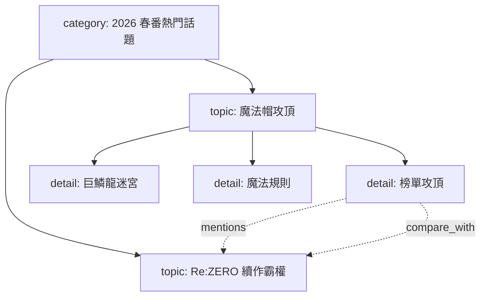

# YouTubeBridge Fact Cards 話題圖譜與 Debug 視覺化設計

## 背景

目前 YouTubeBridge 的 FactCards 以 Markdown 檔案匯入 Topic Pack。每個 `###` 區塊會被切成一筆 `topic_pack_entries`，並建立 embedding。直播注入時，系統會依聊天室留言或導播方向做語意召回，再把少量 Fact Card 文字放進 `external_context`。

這個流程可以避免把整包資料塞入上下文，但有兩個限制：

- Fact Card 之間沒有明確關係。總覽卡、深挖卡、作品實體、比較對象都只是平面的 entry。
- 召回策略偏向單點命中。命中「魔法帽攻頂」時，不一定會自然展開到「第 5 話巨鱗龍迷宮」或被提到的「Re:ZERO 續作霸權」。

目標是把 FactCards 從平面向量資料庫升級成可檢索的話題圖譜：先用語意相似度找入口，再沿著圖譜關係做受控深挖，最後只把最有用的一小組節點放進上下文。

## 目標

- 支援樹狀與網狀話題關係：大分類、深挖內容、跨作品 reference 都能被建模。
- 保留向量召回作為入口，不改成一次塞入全部資料。
- 在語意相似度不足以深挖時，用系統策略引導展開細節。
- 讓 debug UI 可視化目前 Topic Graph、節點關係、召回路徑與上下文選擇原因。
- 保持 FactCards Markdown 現有格式契約，不要求內容作者改寫既有卡片才能獲得基本效果。

## 非目標

- 不把 Topic Graph 寫入 MemoriaCore 主記憶。它仍屬於 YouTubeBridge runtime knowledge。
- 不在公開直播頁顯示內部 graph、分數、prompt 或完整 context。
- 不在直播中自動生成新 FactCards。既有「直播中不可匯入/生成 FactCards」規則維持不變。
- 不要求第一版做到完整知識圖譜推論。第一版以可觀測、可控、可測試的局部展開為主。

## 核心概念

Topic Graph 由節點與邊組成。

節點類型：

- `document`：一個 FactCards Markdown 檔案本身，例如 `20260507_魔法帽的工作室攻頂話題深挖.md`。
- `category`：大分類話題，例如「2026 春番 5 月初熱門話題」。
- `topic`：總覽卡中的主要子題，例如「《魔法帽的工作室》：精緻奇幻新作正式攻頂」。
- `detail`：深挖檔案中的細節節點，例如「第 5 話巨鱗龍迷宮」。
- `entity`：作品、人物、公司、平台、榜單等可被多張卡引用的實體，例如「《Re:從零開始的異世界生活 第四季》」。
- `reference`：不一定有完整 Fact Card，但被文字提到且可作為後續資料補齊的引用點。

邊類型：

- `contains`：document/category 包含主題或細節。
- `detail_of`：深挖節點屬於某個主題或實體。
- `mentions`：文字提到另一個實體或主題。
- `compare_with`：兩個主題被拿來比較、排名、拉鋸或對照。
- `same_entity`：不同檔案或不同標題指向同一作品/人物/概念。
- `semantic_related`：沒有明確 mention，但 embedding 相似度高且通過閾值的輔助關係。

示意：



## 資料模型

延伸現有 Topic Pack schema，新增 graph 專用資料表，避免塞入 `tags_json` 形成難查詢的隱性結構。

### `topic_graph_nodes`

- `id`
- `pack_id`
- `entry_id`，可為空；entity/reference 節點不一定有對應 entry。
- `node_key`，穩定 key，例如正規化作品名或 `file_slug#heading_slug`。
- `node_type`
- `title`
- `summary`
- `source_name`
- `source_heading`
- `metadata_json`
- `created_at`
- `updated_at`

### `topic_graph_edges`

- `id`
- `pack_id`
- `source_node_id`
- `target_node_id`
- `edge_type`
- `weight`
- `evidence`
- `created_at`

### `topic_graph_retrieval_traces`

用來支援 debug UI 與回歸測試。

- `id`
- `session_id`
- `pack_id`
- `source`
- `query_text`
- `entry_node_ids_json`
- `expanded_node_ids_json`
- `selected_node_ids_json`
- `rejected_nodes_json`
- `context_text_preview`
- `created_at`

`rejected_nodes_json` 記錄被排除原因，例如 `score_below_threshold`、`token_budget`、`duplicate_entity`、`edge_budget_exceeded`。

## 建圖流程

FactCards 匯入後執行 graph build。第一版採同步建圖，因為目前匯入發生在直播前或管理流程，不在正式直播中。

建圖步驟：

1. 解析 Markdown title、Summary、Facts 區塊。
2. 每個檔案建立一個 `document` 來源節點；若檔案是總覽型主題卡，再額外建立 `category` 節點。
3. 每個 `###` 仍建立既有 `topic_pack_entries`，同時建立 graph node。
4. 依檔名、標題與內容判斷 node type：
   - 總覽檔中的作品型 `###` 優先視為 `topic`。
   - 檔名或 title 含「深挖」「細節」「補充」時，內部 `###` 優先視為 `detail`。
5. 萃取實體：
   - 第一版使用規則型抽取：`《...》`、英文括號別名、榜單/平台名、製作公司名。
   - 每個實體建立或合併 `entity` node。
6. 建立邊：
   - document/category 到各 topic/detail 用 `contains`。
   - detail node 依檔名與標題中的主作品連到 topic/entity，用 `detail_of`。
   - 內文提到其他作品時，建立 `mentions`。
   - 若句子包含「拉下來」「反超」「對比」「霸權」「排名」等比較語境，建立 `compare_with`。
7. 對 graph node 建立 embedding：
   - 既有 entry node 沿用 `topic_pack_entry_embeddings`。
   - 第一版不為 entity/reference 建立獨立 embedding；這類節點只透過 edge 展開進入候選，避免新增索引路徑時混入太多不確定性。

規則型抽取是第一版預設，不把 LLM 放進建圖主流程。後續可以加一個可手動觸發的 LLM enrichment，但必須保留可重跑、可審查、可失敗降級的行為。

## 召回流程

召回分成五段：入口、展開、排序、裁切、記錄。

### 入口召回

輸入 query 由不同來源組成：

- 觀眾留言：安全後留言、query classifier 的 `sanitized_query`。
- 導播主動回合：目前主題、公開導播提示、上一輪 AI 回覆摘要。
- 手動搜尋：UI search query。

系統先用既有 embedding 搜尋 `topic_pack_entries`，取得 top candidates。這一步維持現有「不相關就不要硬塞」的安全性。

### 圖譜展開

從入口節點開始做受控展開：

- 入口是 `topic`：優先取 `detail_of` 指向自己的 detail nodes。
- 入口是 `detail`：補它的 parent topic，讓模型知道細節所屬大分類。
- 入口文字有 `mentions` 或 `compare_with`：可取 1 個 reference node。
- 最近幾輪已使用同一 detail：降低該 detail 權重，改選同 parent 下未用過的 detail。

第一版預設上限：

- 入口節點最多 2 個。
- 每個入口最多展開 2 個 detail。
- 每輪最多加入 1 個 cross-reference。
- 總選入節點最多 4 個。
- context 文字預算沿用現有 `max_chars`，graph context 不可擠掉聊天室留言。

### 排序與裁切

每個候選節點計算混合分數：

```text
final_score =
  vector_score * 0.55 +
  edge_weight * 0.25 +
  freshness_boost * 0.10 +
  novelty_boost * 0.10
```

`novelty_boost` 來自最近 usage 統計，用來避免角色一直談同一張表層卡。

裁切規則：

- 必須保留聊天室留言。
- 至少保留一個入口節點，否則不注入 graph context。
- detail 與 reference 只能在入口節點已選入時加入。
- 同一 entity 的重複節點只保留分數最高或最具體的一個。

### Context 格式

不要把 graph debug metadata 原樣交給 LLM。給模型的內容保持乾淨，但加上足夠的討論引導。

```text
<topic_pack_fact_cards>
召回策略：先討論「魔法帽攻頂」，可延伸到「第 5 話巨鱗龍迷宮」；若自然比較榜單，可短提「Re:ZERO 續作霸權」。
- [入口] 魔法帽攻頂：...
- [深挖] 第 5 話巨鱗龍迷宮：...
- [關聯] Re:ZERO 續作霸權：...
</topic_pack_fact_cards>
```

`召回策略` 是給角色的輕量引導，不暴露分數、資料表、edge id 或 debug 細節。

## 導播深挖策略

只靠召回文字仍可能讓角色停在表層，因此導播回合要加入「深挖意圖」。

新增內部策略欄位：

- `focus_node_id`
- `focus_depth`
- `preferred_edge_type`
- `avoid_repeating_node_ids`
- `discussion_goal`

導播決策不用公開這些欄位。它們只用於選卡與 context 組裝。

策略範例：

- `continue_topic`：同 parent 下找未用過 detail，讓角色延續。
- `ask_character`：挑一個 detail + 一個 compare/reference，讓角色互問或反駁。
- `transition_topic`：從目前 node 沿 `mentions` 或 `compare_with` 移到新 topic。
- `recap`：只取 parent topic 與已討論 detail，不新增太多新資訊。

這讓系統能在「沒有觀眾新問題」時主動往細節走，而不是每輪重新命中同一張表層卡。

## Debug 網狀圖 UI

新增 YouTubeBridge 控制台中的管理/debug 視圖，不出現在公開直播頁。

### 視覺設計

採暗色 force graph，接近使用者提供的參考截圖。

- 節點顏色：
  - category：藍色
  - topic：白色
  - detail：紫色
  - entity：綠色
  - reference：灰色
- 節點大小：
  - 預設依 usage count。
  - 可切換成 degree centrality 或最近召回分數。
- 邊線：
  - `contains`：低調灰線
  - `detail_of`：紫線
  - `mentions`：藍線
  - `compare_with`：橘線
  - `semantic_related`：虛線
- 互動：
  - hover 顯示 title、type、usage、source file。
  - click 節點高亮一階/二階鄰居。
  - click 邊顯示 edge type、weight、evidence。
  - 最近一次召回路徑用亮色顯示。

### 側邊 debug panel

點擊節點時顯示：

- 節點 title/type/source。
- 對應 Fact Card body preview。
- 連入/連出 edges。
- 最近 usage。
- 最近一次是否進入 context。
- 若未進入 context，顯示排除原因。

點擊 trace 時顯示：

- query text。
- 入口節點。
- 展開節點。
- 最終 selected 節點。
- rejected candidates。
- context preview。

### API

新增管理 API：

- `GET /topic-packs/{pack_id}/graph`
  - 回傳 nodes、edges、basic metrics。
- `POST /topic-packs/{pack_id}/graph/rebuild`
  - 重新從 Topic Pack entries 建圖。
- `GET /sessions/{session_id}/topic-graph/traces?limit=20`
  - 查最近召回 trace。
- `GET /sessions/{session_id}/topic-graph/latest-trace`
  - 給 UI 高亮最近一次召回。

API 回傳必須走 sanitizer，避免把完整 internal prompt 或 hidden context 回到公開 presenter。這些 route 只掛控制台管理面。

## 與現有檔案的落點

預期主要修改範圍：

- `YouTubeBridge/fact_cards.py`
  - 保持 Markdown parser 契約。
  - 可新增標題/實體抽取 helper。
- `YouTubeBridge/engine_topic_packs.py`
  - 匯入後觸發 graph build。
  - 召回改成 graph-aware retrieval。
- `YouTubeBridge/storage_schema.py`
  - 新增 graph tables 與 indexes。
- `YouTubeBridge/storage_repositories/topic_packs.py`
  - 新增 graph CRUD、trace CRUD。
- `YouTubeBridge/bridge_engine.py`
  - `_topic_pack_context_text` 可支援 graph context label。
  - `build_external_context` 維持現有安全流程，但改用 graph retriever 結果。
- `YouTubeBridge/engine_director_runtime.py`
  - 導播主動回合使用 graph-aware sequence/deepening retrieval。
- `YouTubeBridge/server_routes/topic_packs.py`
  - 新增 graph debug API。
- `YouTubeBridge/static/ui/topic-packs.js`
  - 新增 graph debug panel。
- `YouTubeBridge/static/index.html`
  - 放 debug canvas 與 controls。

若 `engine_topic_packs.py` 再膨脹，實作時可拆出 `topic_graph.py` 或 `engine_topic_graph.py`，但第一版只在必要時拆，避免把行為變更與大搬移混在一起。

## 測試策略

### Parser / Graph Build

- 匯入總覽卡後建立 category/topic/entity nodes。
- 匯入深挖卡後建立 detail nodes，並以 `detail_of` 連到主作品 topic。
- 內文提到《Re:從零開始的異世界生活 第四季》時建立 `mentions`。
- 比較語境建立 `compare_with`。
- 重建 graph 不重複建立同一 node/edge。

### Retrieval

- query 命中「魔法帽攻頂」時，結果包含入口 topic 與至少一張魔法帽 detail。
- query 命中「榜單拉鋸」時，可選入 Re:ZERO reference，但不超過 cross-reference 上限。
- 已連續使用同一 detail 後，下次導播主動回合會換同 parent 的其他 detail。
- 不相關 query 不 fallback 到整包 FactCards。
- context 不超過 budget，且聊天室留言不被 graph context 擠掉。

### Debug API / UI

- graph endpoint 不包含 hidden prompt 或 raw external_context。
- trace endpoint 可回放最近一次 selected/rejected 節點。
- UI graph 能顯示 nodes/edges，點擊節點可高亮鄰居並更新側邊欄。

### Regression

優先跑：

```powershell
python -m pytest YouTubeBridge/tests/test_fact_cards.py YouTubeBridge/tests/test_bridge_engine.py YouTubeBridge/tests/test_storage.py -q
```

若有 chat external context 相關修改，再加：

```powershell
python -m pytest tests/test_chat_external_context.py -q
```

遇到 Windows `.pyTestTemp` ACL 問題時，依 repo 規則先跑 `scripts\cleanup_pytest_temp.bat`。

## 分階段落地

### Phase 1：Graph 資料層與建圖

新增 graph tables、建圖 helper、重建 API。匯入 FactCards 後能看到 nodes/edges，但直播召回仍可先維持舊行為。

### Phase 2：Graph-aware Retrieval

將外部 context 與導播 context 的 Topic Pack 召回改成入口 + 深挖 + reference 的受控展開，並寫入 retrieval trace。

### Phase 3：Debug Graph UI

在控制台加網狀圖、trace 高亮、節點側邊欄。這階段主要提升可觀測性，不改召回演算法。

### Phase 4：策略調參與 enrichment

根據直播 debug trace 調整分數權重、展開數量、edge type 優先序。若規則型抽取不足，再加可手動觸發的 LLM enrichment。

## 驗收標準

- 匯入目前兩個 FactCards 檔後，graph 中可看到「2026 春番熱門話題」連到「魔法帽」與「Re:ZERO」等 topic。
- 「魔法帽深挖」檔案中的細節節點會連到魔法帽 topic。
- 魔法帽榜單卡提到 Re:ZERO 時，graph 有 reference edge。
- 直播主動延續魔法帽話題時，context 不只包含表層攻頂卡，也會包含一張深挖卡。
- Debug UI 可視化節點與邊，點擊魔法帽節點可看到深挖與 Re:ZERO reference。
- 最近一次召回 trace 能解釋為什麼某些節點進入 context、某些沒有。
- 既有 FactCards 匯入、Topic Pack usage、external context 安全測試維持通過。
